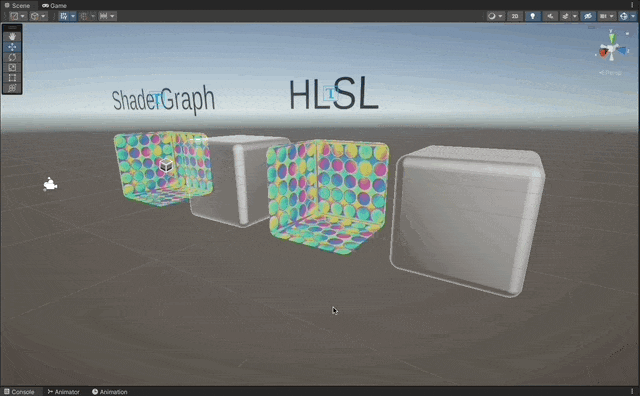
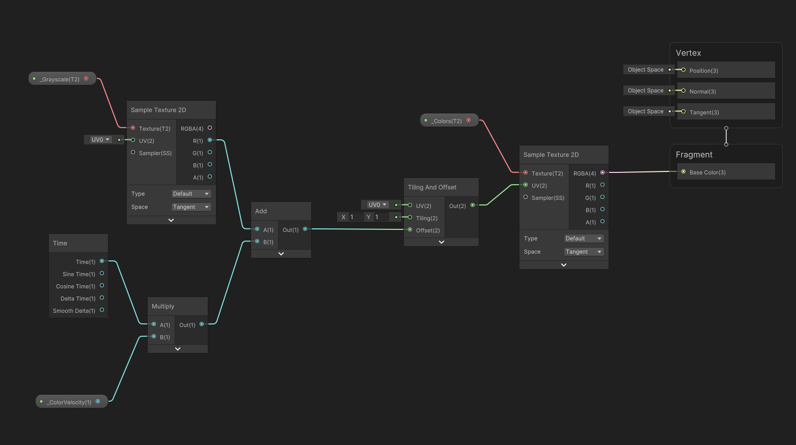
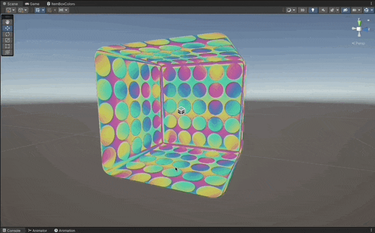
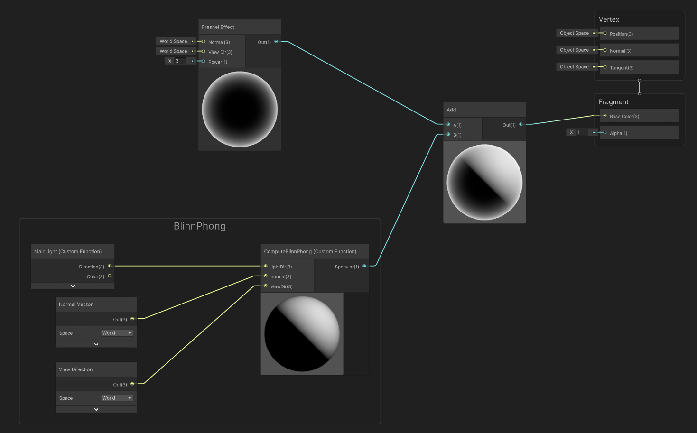
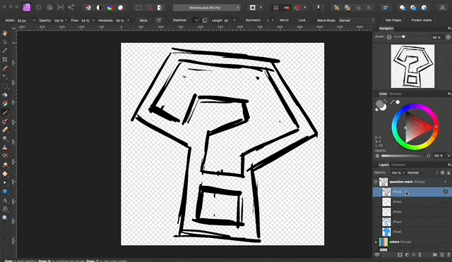
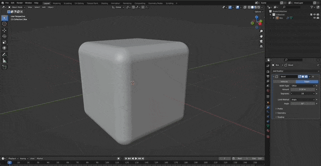

# Mario Kart Item Box VFX

VFX for the item box from the Mario Kart games, implemented both in Shader Graph and in pure HLSL for Universal RP in **Unity 2021.3.10f1**

### References

- [MARIO KART Item Box tutorial by Jettelly](https://www.youtube.com/watch?v=4p0YvPHO4Wc)
- [URP Unlit Shader Structure](https://docs.unity3d.com/Packages/com.unity.render-pipelines.universal@8.2/manual/writing-shaders-urp-basic-unlit-structure.html)
- [Custom Lighting in Shader Graph](https://blog.unity.com/technology/custom-lighting-in-shader-graph-expanding-your-graphs-in-2019)

## Sections

- [Pure HLSL Implemenation](#pure-hlsl-implementation)
  - [Animated Rainbow Colors in pure HLSL](#animated-rainbow-colors-in-pure-hlsl)
  - [Fresnel and BlinnPhong in pure HLSL](#fresnel-and-blinn-phong-in-pure-hlsl)
- [Shader Graph Implementation](#shader-graph-implementation)
  - [Animated Rainbow Colors in ShaderGraph](#animated-rainbow-colors-in-shadergraph)
  - [Fresnel and BlinnPhong in ShaderGraph](#fresnel-and-blinn-phong-in-shadergraph)
- [Creating the Textures](#creating-the-textures)
- [Creating the Mesh](#creating-the-mesh)

## Pure HLSL Implemenation

### Animated Rainbow Colors in pure HLSL

- Mark the shader to cull front (only render inward looking faces)
- Add two `Texture2D` properties, one for the rainbow colors and the other for the grayscale shapes.
- Add a `Velocity` property to control the velocity of the animation.
- Multiply the `Time` variable by the `Velocity` parameter, and add it to the `Red` channel of the `Grayscale` texture.
- Use this value to offset the UVs along the X coordinate.
- Use [frac()](https://learn.microsoft.com/en-us/windows/win32/direct3dhlsl/dx-graphics-hlsl-frac) to ensure the value is between 0 and 1 for uvs.
- Use these new uvs to get the pixel color from the colors texture.

```c
half4 frag(Varyings IN) : SV_Target
{
   half4 grayscaleColor = tex2D(_Grayscale, IN.uv);

   float timeScaled = _Time.y * _ColorVelocity;

   float offset = grayscaleColor.r + timeScaled;
   float2 offsetUVs = float2(frac(IN.uv.x + offset), IN.uv.y);

   half4 rainbowColor = tex2D(_Colors, offsetUVs);

   return rainbowColor;
}
```


### Fresnel and BlinnPhong in pure HLSL

- Add `Tags` to specify the shader will be transparent.
- `ZWrite Off` for best practices.
- Use `Blend One One` to make an [additive](https://docs.unity3d.com/Manual/SL-Blend.html) blend mode with the `Frame Buffer`.

```c
Tags { "RenderType"="Transparent" }
Tags { "Queue"="Transparent" }
LOD 100

ZWrite Off
Blend SrcAlpha OneMinusSrcAlpha
```

- Include the `Core.hlsl` to use stuff like `TransformObjectToHClip` which is included along with [several other transformation functions](https://github.com/Unity-Technologies/Graphics/blob/86cdbd182b8fa8aeda2ff536434f9456f3e5029b/Packages/com.unity.render-pipelines.core/ShaderLibrary/SpaceTransforms.hlsl).
- Include `Lighting.hlsl` so that `GetMainLight()` works inside `MainLight.hlsl`
  - We can't include `Lighting.hlsl` inside `MainLight.hlsl`, becasue that file is also used in shader lab, where it gets compiled along other includes. And it would result in a redefinition of a lot of things.

```c
#include "Packages/com.unity.render-pipelines.universal/ShaderLibrary/Core.hlsl"
#include "Packages/com.unity.render-pipelines.universal/ShaderLibrary/Lighting.hlsl"
#include "./MainLight.hlsl"
#include "./BlinnPhongLighting.hlsl"
```

- Obtain the view dir in world space by substracting the world space position of the vertex to the `_WorldSpaceCameraPos`, which is a [built-in shader variable](https://docs.unity3d.com/Manual/SL-UnityShaderVariables.html).
- Then [normalize()](https://learn.microsoft.com/en-us/windows/win32/direct3dhlsl/dx-graphics-hlsl-normalize) it.

```c
OUT.positionHCS = TransformObjectToHClip(IN.positionOS.xyz);

OUT.normal = IN.normal;

OUT.viewDir = normalize(_WorldSpaceCameraPos.xyz - TransformObjectToWorld(IN.positionOS));
```

- Calculate the `Fresnel` effect by doing the [dot()](https://learn.microsoft.com/en-us/windows/win32/direct3dhlsl/dx-graphics-hlsl-dot) between the view direction and the normal of the pixel.

```c
// fresnel
half fresnelDot = dot(IN.normal, IN.viewDir);
fresnelDot = saturate(fresnelDot); // clamp to 0,1
half fresnel = max(0.0, 0.6 - fresnelDot); // fresnelDot is zero when normal is 90 deg angle from view dir
```

- Calculate the `BlinnPhong` lighting by doing the dot product between the refracted light dir along the normal, and the view dir.

```c
// blinn phong
float3 lightDir = 0;
float3 lightColor = 0;
MainLight_half(lightDir, lightColor);

half specular = 0;
ComputeBlinnPhong_half(lightDir, IN.normal, IN.viewDir, specular);
```

```c
void MainLight_half(out half3 Direction, out half3 Color)
{
    Light light = GetMainLight();
    Direction = light.direction;
    Color = light.color;
}
```

```c
void ComputeBlinnPhong_half(half3 lightDir, half3 normal, half3 viewDir, out half Specular)
{
    half3 reflectedLightDir = reflect(lightDir, normal);

    Specular = max(0, dot(-viewDir, reflectedLightDir)); // avoid negative values
}
```



## Shader Graph Implementation

### Animated Rainbow Colors in ShaderGraph

- Add two `Texture2D` properties, one for the rainbow colors and the other for the grayscale shapes.
- Add a `Velocity` property to control the velocity of the animation.
- Multiply the `Time` variable by the `Velocity` parameter, and add it to the `Red` channel of the `Grayscale` texture.
- Use this value as an offset in the `Tiling and Offset` node used to determine the UVs of the sampler 2D for the rainbow colors.
- Mark the shader to cull front (only render inward looking faces)

#### Graph



#### Result




### Fresnel and BlinnPhong in ShaderGraph

- Add a `Fresnel Effect` Node.
- Define a `Custom Function` Node and make it use the `hlsl` file with the function that grabs the main light.
- Define another `Custom Function` Node to compute the `Blinn Phong` lighting.
- Implement the `.hlsl` code to compute the main light direction and the blinn phong lighting:
  - Reflect the view direction along the normal.
  - Calculate the `dot` product between the inverted view direction, and the reflected light.
  - The stronger the dot product, the stronger the specular.
- Use the `Normal Vector` and `View Direction` nodes, along with the calculated `Main Light` direction, to compute the basic `Blinn Phong` lighting in the custom function.
- Add the `Fresnel` and the `Blinn Phong` together.

#### HLSL Snippets

```c
void MainLight_half(out half3 Direction, out half3 Color)
{
    // https://blog.unity.com/technology/custom-lighting-in-shader-graph-expanding-your-graphs-in-2019
    #if SHADERGRAPH_PREVIEW
        Direction = half3(0.5, 0.5, 0);
        Color = 1;
    #else
        Light light = GetMainLight();
        Direction = light.direction;
        Color = light.color;
    #endif
}
```

```c
void ComputeBlinnPhong_half(half3 lightDir, half3 normal, half3 viewDir, out half Specular)
{
    half3 reflectedLightDir = reflect(lightDir, normal);

    Specular = max(0, dot(-viewDir, reflectedLightDir)); // avoid negative values
}
```

#### Graph



#### Result


## Creating the Textures




## Creating the Mesh


