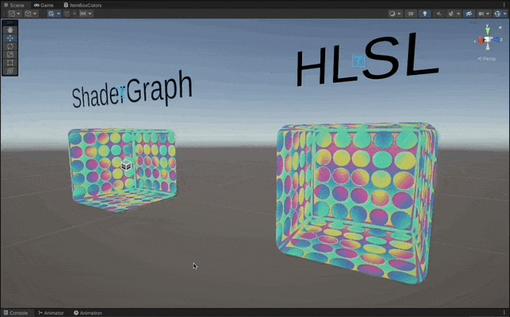
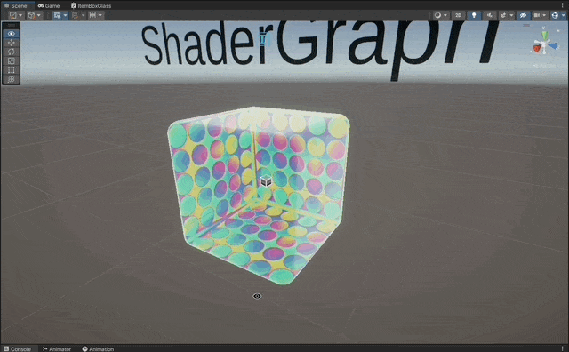

# Mario Kart Item Box VFX

VFX for the item box from the Mario Kart games, implemented both in Shader Graph and in pure HLSL for Universal RP in **Unity 2021.3.10f1**

### References

- [MARIO KART Item Box tutorial by Jettelly](https://www.youtube.com/watch?v=4p0YvPHO4Wc)
- [URP Unlit Shader Structure](https://docs.unity3d.com/Packages/com.unity.render-pipelines.universal@8.2/manual/writing-shaders-urp-basic-unlit-structure.html)
- [Custom Lighting in Shader Graph](https://blog.unity.com/technology/custom-lighting-in-shader-graph-expanding-your-graphs-in-2019)

## Sections

- [Pure HLSL Implemenation](#pure-hlsl-implementation)
  - [Animated Rainbow Colors in pure HLSL](#animated-rainbow-colors-in-pure-hlsl)
- [Shader Graph Implementation](#shader-graph-implementation)
  - [Animated Rainbow Colors in ShaderGraph](#animated-rainbow-colors-in-shadergraph)
  - [Fresnel and BlinnPhong in ShaderGraph](#fresnel-and-blinn-phong-in-shadergraph)
- [Creating the Textures](#creating-the-textures)
- [Creating the Mesh](#creating-the-mesh)

## Pure HLSL Implemenation

### Animated Rainbow Colors in pure HLSL

1. Mark the shader to cull front (only render inward looking faces)
1. Add two `Texture2D` properties, one for the rainbow colors and the other for the grayscale shapes.
1. Add a `Velocity` property to control the velocity of the animation.
1. Multiply the `Time` variable by the `Velocity` parameter, and add it to the `Red` channel of the `Grayscale` texture.
1. Use this value to offset the UVs along the X coordinate.
1. Use [frac()](https://learn.microsoft.com/en-us/windows/win32/direct3dhlsl/dx-graphics-hlsl-frac) to ensure the value is between 0 and 1 for uvs.
1. Use these new uvs to get the pixel color from the colors texture.

```c
half4 frag(Varyings IN) : SV_Target
{
   half4 grayscaleColor = tex2D(_Grayscale, IN.uv);

   float timeScaled = _Time.y * _ColorVelocity;

   float offset = grayscaleColor.r + timeScaled;
   float2 offsetUVs = float2(frac(IN.uv.x + offset), IN.uv.y);

   half4 rainbowColor = tex2D(_Colors, offsetUVs);

   return rainbowColor;
}
```



## Shader Graph Implementation

### Animated Rainbow Colors in ShaderGraph

1. Add two `Texture2D` properties, one for the rainbow colors and the other for the grayscale shapes.
1. Add a `Velocity` property to control the velocity of the animation.
1. Multiply the `Time` variable by the `Velocity` parameter, and add it to the `Red` channel of the `Grayscale` texture.
1. Use this value as an offset in the `Tiling and Offset` node used to determine the UVs of the sampler 2D for the rainbow colors.
1. Mark the shader to cull front (only render inward looking faces)

#### Graph


#### Result


### Fresnel and BlinnPhong in ShaderGraph

1. Add a `Fresnel Effect` Node.
1. Define a `Custom Function` Node and make it use the `hlsl` file with the function that grabs the main light.
1. Define another `Custom Function` Node to compute the `Blinn Phong` lighting.
1. Implement the `.hlsl` code to compute the main light direction and the blinn phong lighting:
   1. Reflect the view direction along the normal.
   1. Calculate the `dot` product between the inverted view direction, and the reflected light.
   1. The stronger the dot product, the stronger the specular.
1. Use the `Normal Vector` and `View Direction` nodes, along with the calculated `Main Light` direction, to compute the basic `Blinn Phong` lighting in the custom function.
1. Add the `Fresnel` and the `Blinn Phong` together.

#### HLSL

```c
void MainLight_half(out half3 Direction, out half3 Color)
{
    // https://blog.unity.com/technology/custom-lighting-in-shader-graph-expanding-your-graphs-in-2019
    #if SHADERGRAPH_PREVIEW
        Direction = half3(0.5, 0.5, 0);
        Color = 1;
    #else
        Light light = GetMainLight();
        Direction = light.direction;
        Color = light.color;
    #endif
}
```

```c
void ComputeBlinnPhong_half(half3 lightDir, half3 normal, half3 viewDir, out half Specular)
{
    half3 reflectedLightDir = reflect(lightDir, normal);

    Specular = max(0, dot(-viewDir, reflectedLightDir)); // avoid negative values
}
```

#### Graph


#### Result




## Creating the Textures


## Creating the Mesh


